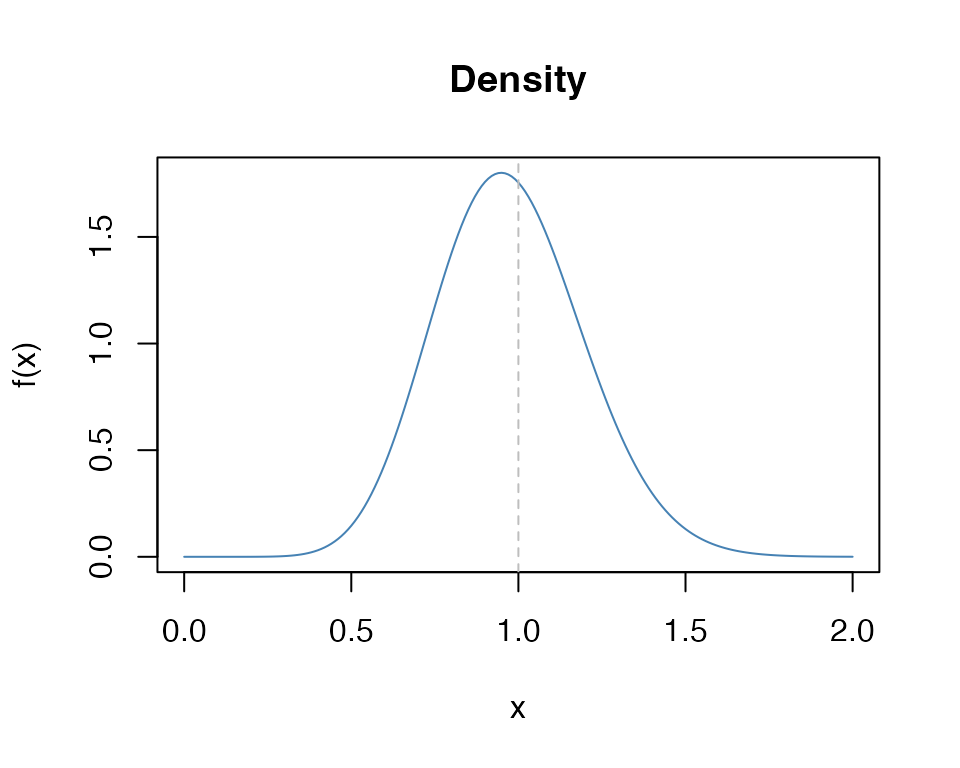
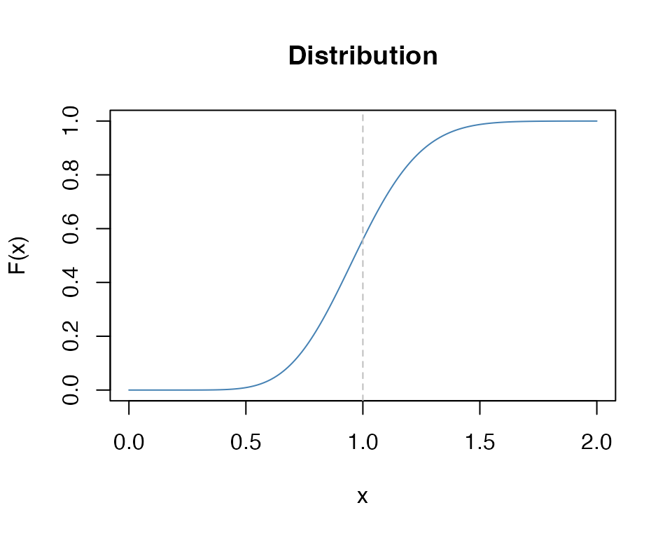
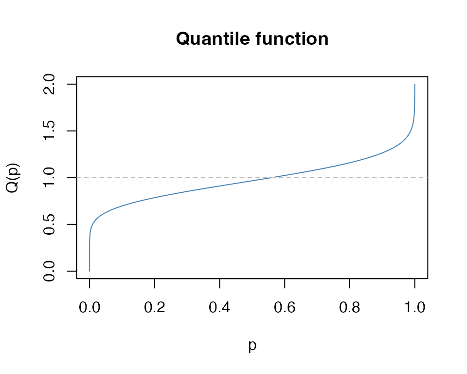
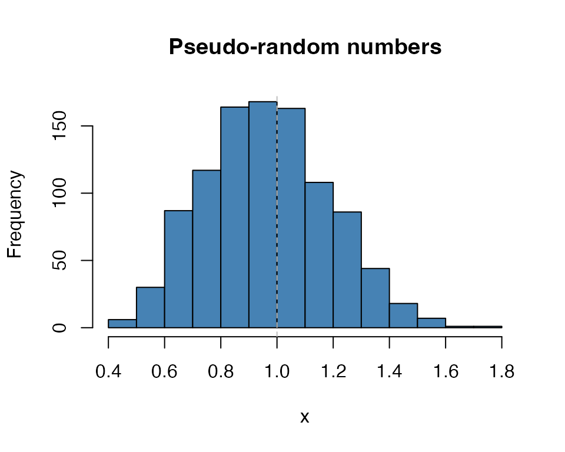

# The K distribution

## Definition

Suppose $`X \sim \chi^2_m`$ is a Chi-squared random variate on $`m`$
degrees of freedom. Then the distribution of
``` math
Y = \sqrt{\frac{X}{m}}
```
is the *Kay* distribution on $`m`$ degrees of freedom, written as
``` math
Y \sim K_m.
```
Its density is
``` math
f(y) = \left\{\begin{array}{lcl}
    \frac{m^{\frac{m}{2}} y ^{m-1} e^{-\frac{1}{2} m y^2}} {2^{\frac{m}{2}-1} \Gamma(\frac{m}{2})} &~~~& \text{for} ~~ 0 \le y < \infty \\
    &&\\
    0 && \text{otherwise}.
    \end{array}
    \right.
```

The $`K_m`$ density has some very attractive features over the
$`\chi^2_m`$ density:

- $`K_m`$ has a much more symmetric density than had the $`\chi^2_m`$,
  for any $`m`$;
- like a $`\chi^2_m`$ density a $`K_m`$ density, as
  $`m \rightarrow \infty`$$`K_m`$ becomes more symmetric and nearly
  normally distributed but does both faster than a $`\chi^2_m`$;
- as $`m \uparrow`$, the $`K_m`$ density concentrates around the value
  $`y=1`$, rather than heading off to $`\infty`$ like the $`\chi^2_m`$;


As m increases, Km has better properties

These values were calculated using the `dkay(...)` density function. For
example, `dkay(1.0, df=10) =` 1.7546737.

### Normal theory relations

Perhaps the most obvious relation between a normal random variate and a
$`K_m`$ is that if $`Z \sim N(0,1)`$, then $`|Z|\sim K_1`$, the
half-normal.

More important in applications is that distribution of the estimator of
the sample standard deviation is proportional to a $`K_m`$. To be
precise, if $`Y_1, \ldots, Y_n`$ are independent and identically
distributed as $`N(\mu, \sigma^2)`$ random variates, with realizations
$`y_1, \ldots, y_n`$ and the usual estimates
$`\widehat{\mu} = \sum y_i /n`$ and
$`\widehat{\sigma} = \sqrt{\sum (y_i - \widehat{\mu})^2/(n-1)}`$, then
the corresponding estimators $`\widetilde{\mu}`$ and
$`\widetilde{\sigma}`$ are distributed as
``` math
 \widetilde{\mu} \sim N(\mu, \frac{\sigma^2}{n})  ~~~~~\text{and} ~~~~~  \frac{\widetilde{\sigma}}{\sigma} \sim K_{n-1}. 
```
The latter shows that $`K_m`$ is used for inference (e.g. tests and
confidence intervals) about $`\sigma`$.

This is handy because the $`K_m`$ quantiles vary much less than do those
of $`\chi^2_m`$. For example, condider the following table of the
cumulative distribution.

|  df |    p=0.05 |     p=0.5 |   p=0.95 |
|----:|----------:|----------:|---------:|
|   1 | 0.0627068 | 0.6744898 | 1.959964 |
|   2 | 0.2264802 | 0.8325546 | 1.730818 |
|   3 | 0.3424648 | 0.8880642 | 1.613973 |
|   4 | 0.4215220 | 0.9160641 | 1.540108 |
|   5 | 0.4786390 | 0.9328944 | 1.487985 |
|   6 | 0.5220764 | 0.9441152 | 1.448654 |
|   7 | 0.5564364 | 0.9521263 | 1.417601 |
|   8 | 0.5844481 | 0.9581311 | 1.392269 |
|   9 | 0.6078297 | 0.9627987 | 1.371090 |
|  10 | 0.6277180 | 0.9665308 | 1.353035 |
|  15 | 0.6957463 | 0.9777136 | 1.290886 |
|  20 | 0.7365735 | 0.9832962 | 1.253205 |
|  25 | 0.7644974 | 0.9866425 | 1.227232 |
|  30 | 0.7851255 | 0.9888719 | 1.207932 |
|  35 | 0.8011601 | 0.9904636 | 1.192858 |
|  40 | 0.8140839 | 0.9916570 | 1.180662 |

Unlike the $`\chi^2_m`$ distribution, the quantiles in this table
stabilize, allowing $`1 \pm 0.20`$ being not a bad rule of thumb for a
$`90\%`$ probability of the ratio $`\widetilde{\sigma}/\sigma`$.

These values were calculated using the `qkay(...)` quantile function.
For example, `qkay(0.05, df=5) =` 0.478639. These would be used to
construct interval estimates for $`\sigma`$.

To get observed significance levels, the cumulative distribution
function `pkay(...)` would be used. For example,
`SL = 1- pkay(1.4, df=10) = 1 -` 0.9667287 `=` 0.0332713.

#### The Student t distribution

For the standard normal theory, the Student $`t_m`$ distribution can be
defined as follows. If $`Z \sim N(0,1)`$ and $`Y \sim K_m`$ is
distributed independently of $`Z`$, then the ratio
``` math
T=\frac{Z}{Y} = \frac{N(0,1)}{K_m} = t_m
```
which is fairly easy to remember.

For the estimators from the above model
``` math
\frac{\widetilde{\mu} - \mu}
       {\widetilde{\sigma} / \sqrt{n}}
       = \frac{ \frac{\widetilde{\mu}-\mu}
                     {\sigma/\sqrt{n}}
                     }
              {\frac{\widetilde{\sigma}}
                    {\sigma}
                    }
               = \frac{N(0,1)}{K_{n-1}} = t_{n-1} 
```
is used to construct interval estimates and tests for the value of the
parameter $`\mu`$.

## The functions

As with every other distribution in `R` four functions are provided for
the $`K_m`$ distribution. These are

- `dkay(x, df=m, ...)` which evalutes the density of $`K_m`$ at $`x`$,
- `pkay(x, df=m, ...)` which evalutes the distribution of $`K_m`$ at
  $`x`$,
- `qkay(p, df=m, ...)` which evalutes the quantile of $`K_m`$ at the
  proportion $`p`$,
- `rkay(n, df=m, ...)` which generates $`n`$ pseudo-random realizations
  from $`K_m`$.

The parameters in the ellipsis include a non-centrality parameter. All
functions rely on the corresponding $`\chi^2_m`$ functions in base `R`.

We briefly illustrate each below.

### The density `dkay(x, df, ...)`

``` r

x <- seq(0,2,0.01)
plot(x, dkay(x, df=10), type="l", col="steelblue", 
     main="Density", xlab="x", ylab="f(x)")
abline(v=1.0, lty=2, col="grey")
```



### The cumulative distribution function `pkay(x, df, ...)`

``` r

x <- seq(0,2,0.01)
plot(x, pkay(x, df=10), type="l", col="steelblue", 
     main="Distribution", xlab="x", ylab="F(x)")
abline(v=1.0, lty=2, col="grey")
```



### The quantile function `qkay(p, df, ...)`

``` r

x <- seq(0,2,0.01)
p <- pkay(x, df=10)
plot(p, qkay(p, df=10), type="l", col="steelblue", 
     main="Quantile function", xlab="p", ylab="Q(p)")
abline(h=1.0, lty=2, col="grey")
```



### Pseudo-random realizations `rkay(n, df, ...)`

``` r

x <- rkay(1000, df=10)
hist(x, col="steelblue", 
     main="Pseudo-random numbers", xlab="x")
abline(v=1.0, lty=2, col="grey")
```


